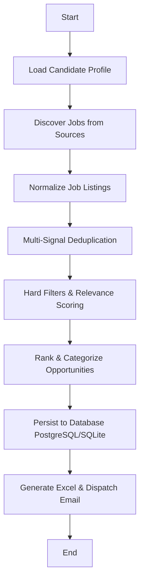

# 🤖 AI-Powered Job Discovery & Matching Agent

[](https://job-discovery-matching-agent-vwnvcalcnpvujurldvgokt.streamlit.app/)

An intelligent, multi-agent automated system built with **LangGraph**, **Pydantic**, **SQLAlchemy**, and **RapidFuzz** that continuously discovers, standardizes, deduplicates, and evaluates job listings against a candidate's specific profile—generating structured Excel match reports and automated email notifications.

> 🚀 **[Live Demo → Click the badge above to launch the Streamlit dashboard](https://job-discovery-matching-agent-vwnvcalcnpvujurldvgokt.streamlit.app/)**

---

## 🚀 Key Features

- **Multi-Source Ingestion & Discovery**: Pluggable adapters for LinkedIn, Indeed, Naukri, and direct career portals with resilient error isolation.
- **Canonical Normalization**: Standardizes non-uniform job titles, experience requirements, work modes (Remote/Hybrid/On-site), and date postings.
- **Multi-Signal Deduplication**: Merges duplicate listings across different platforms using URL matching, source IDs, fuzzy token matching (RapidFuzz), and description similarity.
- **4-Layer Relevance Scoring Engine**:
  1. *Layer 1 (Hard Filters)*: Experience boundaries with candidate-specified tolerance, location & work mode constraints.
  2. *Layer 2 (Heuristic Scoring)*: 7-dimension weighted scoring (Role relevance, Technical skills match, Experience level match, Education match, Location & work mode, Seniority alignment, Freshness).
  3. *Layer 3 (Semantic Similarity)*: Embedding vector similarity hook for deep semantic alignment.
  4. *Layer 4 (Categorization)*: Stratifies into `HIGH_MATCH` (≥85%), `GOOD_MATCH` (≥70%), `STRETCH` (≥55%), and `LOW_MATCH` (<55%).
- **Explainable Match Insights**: Provides explicit bulleted "Why This Matches" explanations, alongside matched and missing skill breakdowns.
- **Dual-Engine Database Persistence**: Production-ready PostgreSQL persistence with automated fallback to zero-config SQLite (`job_agent.db`).
- **Professional Excel Reporting**: Generates formatted, multi-sheet workbooks (`Summary` dashboard + color-coded `Job Matches` with frozen panes, hyperlinks, and auto-filters).
- **Notification System**: Dispatches automated email digests with attached Excel reports (supports both local preview logs and live SMTP with TLS).
- **LangGraph Multi-Agent Orchestration**: Modular, state-driven workflow graph coordinating the end-to-end pipeline.

---

## 🏗️ Architecture & Pipeline Flow



---

## 📁 Repository Structure

```
AI_jobApply/
├── app/
│   ├── agents/
│   │   ├── discovery_agent.py      # Aggregates listings across sources
│   │   ├── matching_agent.py       # Deduplication & relevance evaluation
│   │   ├── normalization_agent.py  # Cleans and standardizes raw postings
│   │   ├── profile_agent.py        # Candidate profile loader & validator
│   │   ├── ranking_agent.py        # Sorts & stratifies top recommendations
│   │   └── report_agent.py         # Coordinates Excel & email dispatch
│   ├── database/
│   │   ├── connection.py           # DB engine with SQLite fallback
│   │   ├── models.py               # SQLAlchemy schema (Candidates, Jobs, Runs, Matches)
│   │   └── repository.py           # Data access repository
│   ├── graph/
│   │   ├── state.py                # LangGraph state definition
│   │   └── workflow.py             # StateGraph definition and compilation
│   ├── matching/
│   │   ├── embeddings.py           # Semantic embeddings interface
│   │   ├── rules.py                # Regex extraction, date parsing & hard filters
│   │   ├── schema.py               # Pydantic models & enums
│   │   └── scoring.py              # 7-dimensional scoring & match categorization
│   ├── reports/
│   │   ├── email.py                # SMTP & Mock email delivery service
│   │   └── excel.py                # Openpyxl styled Excel report generator
│   ├── sources/
│   │   ├── base.py                 # Abstract JobSource interface
│   │   ├── indeed.py               # Indeed source adapter
│   │   ├── linkedin.py             # LinkedIn source adapter
│   │   ├── mock_source.py          # Realistic career portal source
│   │   └── naukri.py               # Naukri source adapter
│   ├── config.py                   # Pydantic application settings
│   ├── main.py                     # CLI pipeline entry point
│   └── run.py                      # Convenience runner script
├── config/
│   └── candidate_profile.json      # Customizable candidate resume & scoring weights
├── data/
│   └── sample_jobs.json            # Curated cross-platform sample job listings
├── reports/                        # Output directory for generated reports
├── tests/                          # Comprehensive Pytest test suite (22 tests)
├── .env.example                    # Environment variable template
├── Dockerfile                      # Container definition
├── docker-compose.yml              # PostgreSQL + Job Agent compose stack
└── requirements.txt                # Python dependencies
```

---

## 🛠️ Quick Start

### 1. Installation
Clone the repository and install the dependencies in a virtual environment:
```bash
python -m venv .venv
# On Windows:
.venv\Scripts\activate
# On Linux/macOS:
source .venv/bin/activate

pip install -r requirements.txt
```

### 2. Configuration
Create your local environment file:
```bash
cp .env.example .env
```
Adjust `candidate_profile.json` in `config/` to reflect your target roles, skills, and experience preferences.

### 3. Run the Pipeline
Execute the automated discovery and matching agent:
```bash
python -m app.main
```
The pipeline will:
1. Ingest job postings across all active sources.
2. Normalize and deduplicate duplicate listings.
3. Score each job against `candidate_profile.json`.
4. Persist run statistics and matched opportunities to SQLite/PostgreSQL.
5. Save a styled spreadsheet in `reports/job_matches_YYYY-MM-DD.xlsx`.
6. Dispatch an email preview or SMTP message.

---

## 🧪 Running Tests

Run the full automated test suite with `pytest`:
```bash
pytest
```
Includes tests for profile loading, job normalization, multi-signal deduplication, scoring layers, ranking, Excel output, and end-to-end integration.

---

## 🐳 Docker Support

To run the agent alongside PostgreSQL using Docker Compose:
```bash
docker-compose up --build
```
The service will initialize PostgreSQL, execute database migrations automatically, run the agent workflow, and save reports into the mounted `./reports/` directory.
